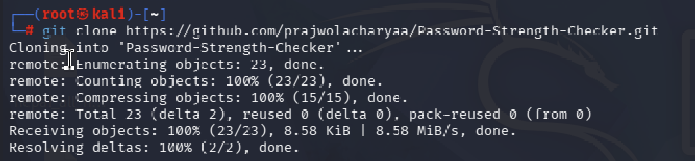
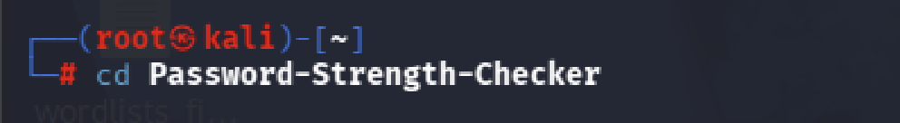
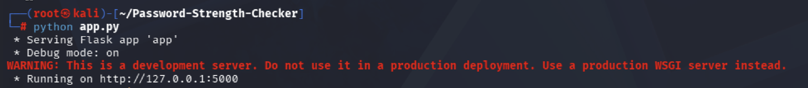
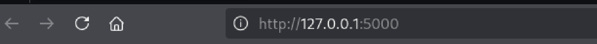

# Password Strength Checker

A web-based Password Strength Checker built using Python and Flask. This project analyzes password strength using entropy, common password lists, and pattern detection to give users a clear strength rating and suggestions for improvement.

---

# Features

- Password strength evaluation  
- Entropy-based analysis  
- Detection of common and weak passwords  
- Pattern recognition (repeated characters, keyboard patterns, etc.)  
- Simple and clean web interface  
- Instant feedback on password security  

---

# Tech Stack

- Python  
- Flask  
- HTML  
- CSS  

---

# Project Structure

app.py → Main Flask application  
checker/ → Core logic (strength, entropy, patterns)  
templates/ → HTML pages  
static/ → CSS files  
data/ → Common password dataset  
requirements.txt → Dependencies  

---

# Installation & Setup (Kali Linux)

## Step 1: Clone the repository

git clone https://github.com/prajwolacharyaa/Password-Strength-Checker.git

---

## Step 2: Open project folder

cd Password-Strength-Checker

---

## Step 3: Install dependencies

pip install -r requirements.txt

---

## Step 4: Run the application

python app.py

---

## Step 5: Open in browser

http://127.0.0.1:5000

---

# Screenshots

Step 1: Clone Repository  

Step 2: Open Project Folder  

Step 3: Install Requirements & Run App  

Step 4: Open Local Server  

---

# For Windows : 

PASSWORD STRENGTH CHECKER - RUN GUIDE (WINDOWS)

--------------------------------------------
REQUIREMENTS
--------------------------------------------
1. Install Python (3.x)
   Download: https://www.python.org/downloads/
   IMPORTANT: Tick "Add Python to PATH" during installation

2. Install Git (if not installed)
   Download: https://git-scm.com/downloads

--------------------------------------------
STEP 1: OPEN COMMAND PROMPT
--------------------------------------------
Press:
Win + R
Type: cmd
Press Enter

--------------------------------------------
STEP 2: CLONE REPOSITORY
--------------------------------------------
git clone https://github.com/prajwolacharyaa/Password-Strength-Checker.git

--------------------------------------------
STEP 3: GO INTO PROJECT FOLDER
--------------------------------------------
cd Password-Strength-Checker

--------------------------------------------
STEP 4: CREATE VIRTUAL ENVIRONMENT (OPTIONAL BUT RECOMMENDED)
--------------------------------------------
python -m venv venv

Activate it:
venv\Scripts\activate

--------------------------------------------
STEP 5: INSTALL REQUIREMENTS
--------------------------------------------
pip install -r requirements.txt

--------------------------------------------
STEP 6: RUN PROJECT
--------------------------------------------
python app.py

--------------------------------------------
STEP 7: OPEN IN BROWSER
--------------------------------------------
Open this link in browser:
http://127.0.0.1:5000

--------------------------------------------
DONE
--------------------------------------------
Your Password Strength Checker is now running locally.

# How It Works

1. User enters a password  
2. System checks:
   - Length  
   - Complexity  
   - Patterns  
   - Common passwords database  
3. Generates strength score + feedback  

---

# Disclaimer

This project is for educational and cybersecurity awareness purposes only.

---

# Author

Prajwol Acharya
